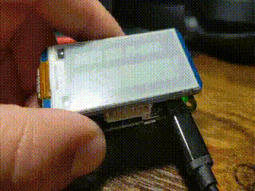

# Create a Pi Day countdown clock with a Raspberry Pi Zero W and an ePaper display

[Pi Day](https://en.wikipedia.org/wiki/Pi_Day) has come and gone, leaving us with fond memories and [plenty of Raspberry Pi projects](#) (LINK TO PROJECTS) to try out.
The days following any holiday can be hard, returning to work after high spirits and plenty of fun, and Pi Day is no exception.
As we look into the face of the Ides of March, we can be left longing for the joys of the previous, well, day.
But fear no more, dear Pi Day celebrant!
For today, we begin the long countdown to the next Pi Day!

Ok, but seriously. I made a Pi Day countdown timer, and you can too!

A while back I purchased a Raspberry Pi Zero W, and recently used it to [try to figure out why my Wifi was so bad](#) (LINK TO PREVIOUS ARTICLE).
I was also intrigued by the idea of getting an ePaper display for the little Zero W.
I didn't have a good use for one, but, dang it, it looked like fun!
I purchased a little 2.13 inch Waveshare display, which fit perfectly on top of the Raspberry Pi Zero W form factor.
It's easy to install: just slip the display down onto the Raspberry Pi GIPO headers, and you're good to move onto the next step.

It's worth noting that I used the Raspberry Pi OS for this project, and while the project can surely be done with other operating systems, the `raspi-config` command, used below, is most easily available on Raspberry Pi OS.

## Setup

Setup of the Raspberry Pi to work with the ePaper display requires you to enable the Serial Peripheral Interface (SPI) in the Raspberry Pi software, install the BCM2835 C libraries (to access the GPIO functions for the Broadcom BCM 2835 chip on the Raspberry Pi), and install Python GPIO libraries to allow us to control the ePaper display.
Finally, we need the Waveshare libraries for working with the 2.13in display using Python.

### Enable SPI

Enabling the Serial Peripheral Interface is most easily done with the Raspberry Pi `raspi-config` command.
The SPI bus allows use of serial data communication with devices - in this case the ePaper display.

<!-- markdownlint-disable MD014 -->
```shell
$ sudo raspi-config
```
<!-- markdownlint-enable MD014 -->

From the menu that pops up, select `Interfacing Options` -> `SPI` -> `Yes` to enable the SPI interface, then Reboot.

### Install BCM2835 libraries

As mentioned above, the BCM2835 libraries are software for the Broadcom BCM2385 chip on the Raspberry Pi, which allows access to the GPIO pins and the ability to use them to control devices.

At the time of this writing, the latest version of the Broadcom BCM 2835 libraries for the Raspberry Pi is version 1.68.
To install the libraries, we need to download the software tarball, and build and install the software with `make`.

```shell
# Download the BCM2853 libraries and extract them
$ curl -sSL http://www.airspayce.com/mikem/bcm2835/bcm2835-1.68.tar.gz -o - | tar -xzf -

# Change directories into the extracted code
$ pushd bcm2835-1.68/

# Configure, build, check and install the BCM2853 libraries
$ sudo ./configure
$ sudo make check
$ sudo make install

# Return to the original directory
$ popd
```

### Install required Python libraries

We also need some Python libraries to allow us to use Python to control the ePaper display, the `RPi.GPIO` Pip package.
We also need the `python3-pil` for drawing shapes.
Apparently the PIL package is all but dead, but there is an alternative, `pillow`.
I have not tested pillow for this project, but it may work.

```shell
# Install the required Python libraries
$ sudo apt-get update
$ sudo apt-get install python3-pip python3-pil
$ sudo pip3 install RPi.GPIO
```

<!-- markdownlint-disable MD036 -->
_Note: instruction here are for Python3.  Python 2 instructions can be found on the WaveShare website_
<!-- markdownlint-enable MD036 -->

### Download WaveShare's examples and Python libraries

Waveshare maintains a Git repository with Python and C libraries for working with their ePaper displays, and some examples that show how to use them.
We will cone this repository and use the libraries for the 2.13in display for this project.
If you're using a different display, or a product from another company, you'll need to use the appropriate software for your display.

```shell
# Clone the WaveShare e-Paper git repository
$ git clone https://github.com/waveshare/e-Paper.git
```

### References

Waveshare provides instructions for most of the above on their site:

* [WaveShare ePaper Setup Instructions](https://www.waveshare.com/wiki/2.13inch_e-Paper_HAT)
* [WaveShare ePaper Libraries Install Instructions](https://www.waveshare.com/wiki/Libraries_Installation_for_RPi)

### Get a fun Font (optional)

We can display our timer however we want, but why not do it with a little style? Let's find a cool font to work with!

There's a ton Open Fonts Licensed fonts available out there.
I am particularly fond of "Bangers".
You've seen this if you ever watched YouTube - it's used _all over_.
It can easily be downloaded and dropped into the local shared fonts directory for your user, making it available for any application, including this project.

```shell
# The "Bangers" font is a Open Fonts License licensed font by Vernon Adams (https://github.com/vernnobile) from Google Fonts
$ mkdir -p ~/.local/share/fonts
$ curl -sSL https://github.com/google/fonts/raw/master/ofl/bangers/Bangers-Regular.ttf -o fonts/Bangers-Regular.ttf
```

## Create a Pi-Day Countdown timer

Now that we have the software required to work with the ePaper display installed and a fun font to use, we can build something cool with it: a countdown timer till the next Pi Day!

If you like, you can just grab the [countdown.py Python file](https://github.com/clcollins/epaper-pi-ex/blob/main/countdown.py) that comes in the [Github repo accompanying this article](https://github.com/clcollins/epaper-pi-ex/) and skip to the end.

Let's take a look at that file, section by section:

### Importing some Libraries

```python
#!/usr/bin/python3
# -*- coding:utf-8 -*-
import logging
import os
import sys
import time

from datetime import datetime
from pathlib import Path
from PIL import Image,ImageDraw,ImageFont

logging.basicConfig(level=logging.INFO)

basedir = Path(__file__).parent
waveshare_base = basedir.joinpath('e-Paper', 'RaspberryPi_JetsonNano', 'python')
libdir = waveshare_base.joinpath('lib')
```

Starting out our Python script, we import some standard libraries we'll use later in the script.
We also need to add `Image`, `ImageDraw` and `ImageFont` from the PIL package, which we'll use to draw some simple geometric shapes.
Finally, we set some variables for the local lib directory which contains the Waveshare Python libraries for working with the 2.13in display, which we can use later to load the library from the local directory.

### Font size helper function

The script then has a helper function for setting the font size for our chosen font: Bangers-Regular.ttf.
This just takes an integer for the font size itself, and returns an ImageFont object we can use with the display.

```python
def set_font_size(font_size):
    logging.info("Loading font...")
    return ImageFont.truetype(f"{basedir.joinpath('Bangers-Regular.ttf').resolve()}", font_size)
```

### Countdown logic

Next is a small function that calculates the meat of our project: how long it is until the next Pi Day.
If it were, say, January, it would be relatively straightforward to count how many days are left, but we also need to take into account if Pi Day has already passed for the year (sadface), and if so, count how very, very many days are ahead of us until we can celebrate again:

```python
 def countdown(now):
    piday = datetime(now.year, 3, 14)

    # Add a year if we're past PiDay
    if piday < now:
        piday = datetime((now.year + 1), 3, 14)

    days = (piday - now).days

    logging.info(f"Days till piday: {days}")
    return day
```

### The Main function

Finally, we get to the main function which will initialize the display and then begin writing data to it.
In our case, we'll write a welcome message, and then begin the countdown to the next Pi Day.
But first, we need to load the Waveshare library:

```python
def main():

    if os.path.exists(libdir):
        sys.path.append(f"{libdir}")
        from waveshare_epd import epd2in13_V2
    else:
        logging.fatal(f"not found: {libdir}")
        sys.exit(1)
```

In the snippet above, we're checking to make sure the library has been downloaded to a directory alongside this countdown script, and then loading the `epd2in13_V2` library.
If you're using a different display, you will need to use a different library.
You can also write your own, if you are so inclined.
I actually found it kind of interesting reading the Python code Waveshare provided with the display.
It's considerably less complicated than I would have imagined it to be, if somewhat tedious.

The next bit of code creates an epd (ePaper Display) object, to interact with the display, and initialized the hardware:

```python
    logging.info("Starting...")
    try:
        # Create an a display object
        epd = epd2in13_V2.EPD()

        # Initialize the displace, and make sure it's clear
        # ePaper keeps it's state unless updated!
        logging.info("Initialize and clear...")
        epd.init(epd.FULL_UPDATE)
        epd.Clear(0xFF)
```

An interesting aside about ePaper: it is only using power when it changes a pixel from white to black or vice-versa.
This means that when the power is removed from the device, or if the application stops for whatever reason, whatever was on the screen remains.
That's great from a power consumption perspective, but it also means we need to clear the display when starting up, or our script will just write over whatever is already on the screen.
Hence: `epd.Clear(0xFF)` is used to clear the display when the script starts.

Next, we create a "canvas" on which we will draw the rest of our display output:

```python
    # Create an image object
    # NOTE: The "epd.heigh" is the LONG side of the screen
    # NOTE: The "epd.width" is the SHORT side of the screen
    # Counter-intuitive...
    logging.info(f"Creating canvas - height: {epd.height}, width: {epd.width}")
    image = Image.new('1', (epd.height, epd.width), 255)  # 255: clear the frame
    draw = ImageDraw.Draw(image)
```

This matches to the width and height of the display, but is somewhat  counter-intuitive.
The short side of the display is the width.
At least in my own mind, I think of the long side being the width.
Just something to note.
Note that the `epd.height` and `epd.width` are set by the Waveshare library to correspond to the device we're using.

### Creating a welcome message

Next, we'll actually start to draw something.
This involves setting data on the "canvas" object we created above.
This doesn't actually draw it to the ePaper display yet - we're just building the image we want right now.
Let's create a little welcome message celebrating Pi Day, with an image of a piece of pie, drawn by yours truly just for this project:


Cute, huh?

```python
    logging.info("Set text text...")
    bangers64 = set_font_size(64)
    draw.text((0, 30), 'PI DAY!', font = bangers64, fill = 0)

    logging.info("Set BMP...")
    bmp = Image.open(basedir.joinpath("img", "pie.bmp"))
    image.paste(bmp, (150,2))
```

Finally, finally, we get to actually displaying the canvas we drew, and it's a little bit anti-climactic:

```python
    logging.info("Display text and BMP")
    epd.display(epd.getbuffer(image))
```

That bit above updates the display itself to show the image we've drawn.

Next, we can prepare another image to display: our countdown timer.

### The Pi Day Countdown timer

First, we need to create a new image object that we can draw to the display.
We also set some new font sizes to use for the image:

```python
    logging.info("Pi Date countdown; press CTRL-C to exit")
    piday_image = Image.new('1', (epd.height, epd.width), 255)
    piday_draw = ImageDraw.Draw(piday_image)

    # Set some more fonts
    bangers36 = set_font_size(36)
    bangers64 = set_font_size(64)
```

To display a ticker like our countdown, it's more efficient to just update part of the image, changing on the display only what has changed in the data we want to draw.
The next bit of code prepares the display to function in this way:

```python
    # Prep for updating display
    epd.displayPartBaseImage(epd.getbuffer(piday_image))
    epd.init(epd.PART_UPDATE)
```

Finally, we get to the timer bit, starting an infinite loop that checks how long it is until the next Pi Day, and displays the countdown on the ePaper display.
If it actually _is_ Pi Day, we handle that too, with a little celebration message.

```python
    while (True):
        days = countdown(datetime.now())
        unit = get_days_unit(days)

        # Clear the bottom half of the screen by drawing a rectangle filld with white
        piday_draw.rectangle((0, 50, 250, 122), fill = 255)

        # Draw the Header
        piday_draw.text((10,10), "Days till Pi-day:", font = bangers36, fill = 0)

        if days == 0:
            # Draw the Pi Day celebration text!
            piday_draw.text((0, 50), f"It's Pi Day!", font = bangers64, fill = 0)
        else:
            # Draw how many days until Pi Day
            piday_draw.text((70, 50), f"{str(days)} {unit}", font = bangers64, fill = 0)

        # Render the screen
        epd.displayPartial(epd.getbuffer(piday_image))
        time.sleep(5)
```

The last bit of the script is some error handling, including some code to catch keyboard interrupts so we can stop the infinite loop with `CTLR-C`, and a small function to print "day" or "days" depending on whether or not the output should be singular (for that one, single day that it's appropriate each year).

```python

    except IOError as e:
        logging.info(e)

    except KeyboardInterrupt:
        logging.info("Exiting...")
        epd.init(epd.FULL_UPDATE)
        epd.Clear(0xFF)
        time.sleep(1)
        epd2in13_V2.epdconfig.module_exit()
        exit()


def get_days_unit(count):
    if count == 1:
        return "day"

    return "days"


if __name__ == "__main__":
    main()
```

And there you have it!
A script to countdown and display how many days are left until Pi Day!
Here's an action shot on my own Raspberry Pi (sped up by 86400 - I don't have nearly enough disk space to save a day-long video):



### Install the Systemd Service (optional)

If you'd like for the countdown display to run whenever the system is turned on, and without you having to be logged in and running the script, you can install the optional systemd unit as a Systemd user service ([ArchWiki: Systemd User Service](https://wiki.archlinux.org/index.php/systemd/User)).

Copy the provided piday.service file to ${HOME}/.config/systemd/user, creating the directory if it doesn't exist, and then you can enable the service and start it.

<!-- markdownlint-disable MD014 -->
```shell
$ mkdir -p ~/.config/systemd/user
$ cp piday.service ~/.config/systemd/user
$ systemctl --user enable piday.service
$ systemctl --user start piday.service

# Enable lingering, to create a user session at boot
# and allow services to run after logout
$ loginctl enable-linger $USER
```

The script will output to the systemd Journal, and the output can be viewed with the `journalctl` command
<!-- markdownlint-enable MD014 -->

## It's Beginning to Look a Lot Like Pi Day

And _there_ we have it! A Pi Day countdown timer, displayed on an ePaper display on a Raspberry Pi Zero W, and starting on system boot with a systemd unit file!
Now there's just three hundred fifty something days until we can once again come together and celebrate the fantastic device that is the Raspberry Pi, and we can see exactly how many at a glance with our tiny project.

But in truth, one can hold Pi Day in their hearts year-round, so enjoy and create some fun and educational projects with your own Raspberry Pi!
